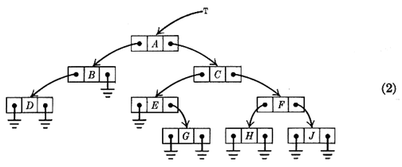
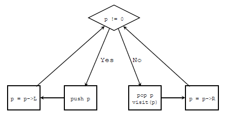
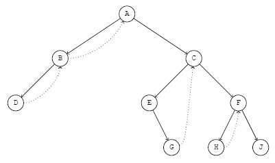

How to traverse a binary tree without using any stack
=====================================================

There is an exercise (ex.2.3.1-21) in `TAOCP <http://www-cs-faculty.stanford.edu/~uno/taocp.html>`_ vol.1:

	21. [33] Design an algorithm that traverses an unthreaded binary tree in inorder *without using any auxiliary stack*.
	It is permissible to alter the ``LLINK`` and ``RLINK`` fields of the tree nodes in ny manner whatsoever during the traversal, subject only to the
	condition that the binary tree should have the conventional representation illustrated in (2) both before and after your algorithm has traversed the tree.
	No other bits in the tree nodes are available for temporary storage.

   (from TAOCP 2.3.1)

In the answer given by Prof. Knuth, an algorithm by Joseph M. Morris [*Inf. Proc. Letters* **9** (1979), 197-200] is introduced.
The algorithm is very interesting. I'd like to show you how it works here.

Inorder traversal using a stack
-------------------------------

First let's see how to do an inorder traversal using a stack:

.. colorcode:: c

	void inorder_traverse(NODE * T)
	{
		NODE * p = T;
		while (1) {
			while (p) {
				PUSH(p);
				p = p->L;
			}
			if (!(p = POP()))
				break;
			visit(p);
			p = p->R;
		}
	}

This function can be illustrated as:

- ``p`` is the *current* node
- if the current is not ``NULL``, we ``push`` it and move left
- if the current is ``NULL``, we ``pop`` a node up, ``visit`` it and move right
- every time we move, either move left or move right, we start a new loop (just like recursion)

The key points are:

- we move left after ``push``\ ing a node, so that we will ``pop`` and ``visit`` nodes from left to right
- we move right after ``pop``\ ing and ``visit``\ ing a node, because the left subtree must have been manipulated

Function ``inorder_traverse`` is not hard to understand. You should have known well about it.
Now let's see how Morris modified it so that no stack is needed any more.

Morris Algorithm
----------------

The following is the pseudo-C code of Morris Algorithm:

.. colorcode:: c
	:linenos:
	:lineanchors: inorder-morris

	void inorder_Morris(NODE * T)
	{
		NODE * p = T;
		while (p) {
			while (p->L) {
				/** insert or remove thread **/
				if (no_thread)
					insert_thread;
				else
					remove_thread;
				p = p->L;
			}
			visit(p);
			p = p->R;
		}
	}

The key point is to transform the binary tree into a *right-threaded binary tree* temporarily and restore it later (line `7`__, `8`__, `9`__, `10`__).

__ #code-inorder-morris-7
__ #code-inorder-morris-8
__ #code-inorder-morris-9
__ #code-inorder-morris-10

A right-threaded binary tree, if you never heard of it, is a binary tree like this:

   Right-threaded binary tree

As this figure shows, the ``NULL`` right child of a node ``P`` is used to point to ``P``\ 's inorder successor (denoted as ``P$``).
That is to say:

1. The right link of any node without a right child will be used as the start of a thread (dotted lines)
2. If a node ``P`` has a left subtree, then ``P`` is the end of a thread whose start point is ``$P`` (``P``\ 's inorder predecessor).
   Therefore, we can add this thread (from ``$P`` to ``P``) when reaching ``P`` and remove it after coming back to ``P`` from ``$P``.

Let's study figure *Right-threaded binary tree*, which is transformed from (2).
There are 4 nodes that have left subtrees: ``A``, ``B``, ``C`` and ``F``, so there are 4 thread that point to them.
The key point is that the nodes pointing to them are their inorder predecessors respectively: ``B``, ``D``, ``G`` and ``H``.
Therefore, we do not need to push ``A``, ``B``, ``C`` and ``F`` into stack, since we can reach them via the right links of their inorder predecessors.

This is the main idea of Morris algorithm. Now let's rewrite our ``inorder_traverse`` so that it looks more like ``inorder_Morris``:

.. colorcode:: c
	:linenos:
	:lineanchors: inorder-traverse-variant

	void inorder_traverse(NODE * T)
	{
		NODE * p = T;
		while (p) {
			while (p->L) {
				if (p != STACK_TOP()) {
					PUSH(p);
				} else {
					p = POP();
					break;
				}
				p = p->L;
			}
			visit(p);
			if (p->R)
				p = p->R;
			else
				p = STACK_TOP(); /* note: STACK[BASE] == 0 */
		}
	}

This is a *disguised* ``inorder_traverse``.
It does the same thing as the first ``inorder_traverse``, but it looks very similar with ``inorder_Morris`` so we only need to do very slight modification and an
implementation of Morris algorithm will be done.

Before implementing the Morris algorithm, let's imagine all threads are inserted into the tree. It's easy to know:

- line `15`__ is always true (except that we have reached the last node)
- if the line from ``p`` to ``p->R`` is a thread, then ``p->R`` always points to the stack top, so we no more need a stack
- to implement Morris algorithm, we only need to replace line `7`__ and `9`__ with ``insert_thread`` code and ``remove_thread`` code respectively and we're done
- after threads are inserted into the tree, there are circles so we can always come back through the right links, so:
    - if a node has no left subtree, ``visit`` it without ``push``\ ing or ``pop``\ ing
    - if a node has a left subtree, do *normal* inorder traversal, except that:
        - insert right thread when ``push`` is needed
        - remove right thread when we come back (i.e. when ``pop`` is needed)

__ #code-inorder-traverse-variant-15
__ #code-inorder-traverse-variant-7
__ #code-inorder-traverse-variant-9

I guess you have understood Morris algorithm well, it's time to code it:

.. colorcode:: c
	:linenos:
	:lineanchors: morris-algorithm

	void Joseph_M_Morris(struct node * T)
	{
		/* U1. [Initialize.] */
		P = T;
		R = 0;

		while (P) { /* U2. [Done?] */
			while (1) {
				/* U3. [Look left.] */
				Q = P->L;
				if (Q == 0) {
					visit(P, preorder);
					break; /* goto U6; */
				}

				/* U4. [Search for thread.] */
				while (Q != R && Q->R != 0)
					Q = Q->R;
				assert(Q == R || Q->R == 0);

				/* U5. [Insert or remove thread.] */
				if (Q != R) {
					Q->R = P;
				} else {
					Q->R = 0;
					break;
				}

				/* U8. [Preorder visit.] */
				visit(P, preorder);

				/* U9. [Go to left.] */
				P = P->L;
				/* goto U3 */
			}

			/* U6. [Inorder visit.] */
			visit(P, inorder);

			/* U7. [Go to right or up.] */
			R = P;
			P = P->R;
			/* goto U2 */
		}
	}

The code implements not only inorder traversal but also preorder traversal. It is not hard with the help of right threads.
The key parts are U4, U5 and line `41`__.

__ #code-morris-algorithm-41

I made a slides showing how this algorithm works. Please click `here`__ (it contains many figures, you may have to wait a while when it's loading).

__ #../morris-algorithm/
